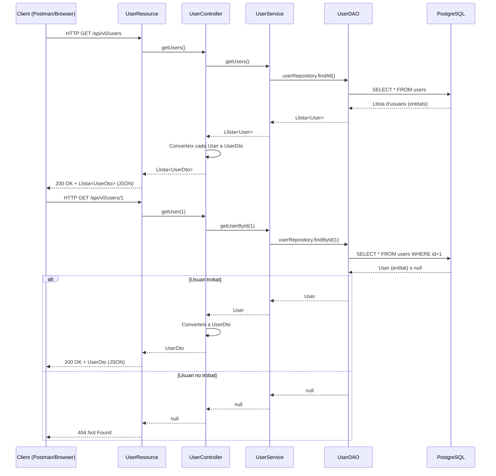
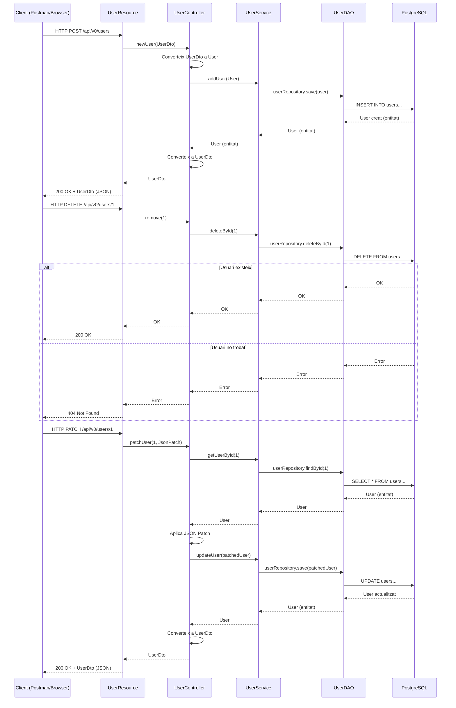

# 🧩 Spring Rest JSON Patch

Aquest projecte és una petita aplicació de backend construïda amb **Spring Boot**, que implementa operacions **CRUD completes** sobre una entitat `User`, i inclou suport per a **actualitzacions parcials** via **JSON Patch** (`application/json-patch+json`).

Es fa servir l'arquitectura en capes:

- `Resource` (exposa endpoints HTTP)
- `Controller` (gestiona la lògica de presentació i conversió DTO)
- `Service` (conté la lògica de negoci)
- `DAO` (accedeix a la base de dades)
- `Entity` / `DTO` (representació de dades)

---

## 🔁 Flux complet de peticions: Anada i tornada

A continuació es mostren els **diagrames de seqüència** que expliquen com viatgen les peticions HTTP pel sistema: **des del client fins a la base de dades i de tornada**.

---

### 🔍 GET – Obtenir usuaris

---

### ➕ POST – Crear, ❌ DELETE – Esborrar, ✂️ PATCH – Actualitzar parcialment

---

## 📌 Tecnologies utilitzades

- Java 17+
- Spring Boot 3+
- Spring Web
- Spring Data JPA
- JSON Patch
- Base de dades (PostgreSQL)
