# 🧩 Spring Rest JSON Patch

Aquest projecte és una petita aplicació de backend construïda amb **Spring Boot**, que implementa operacions **CRUD completes** sobre una entitat `User`, i inclou suport per a **actualitzacions parcials** via **JSON Patch** (`application/json-patch+json`).

Es fa servir l’arquitectura clàssica en capes:

* `RestController` (exposa endpoints HTTP)
* `Service` (conté la lògica de negoci)
* `Repository` (accedeix a la base de dades)
* `Entity` / `DTO` (representació de dades)

---

## 🔁 Flux complet de peticions: Anada i tornada

A continuació es mostren els **diagrames de seqüència** que expliquen com viatgen les peticions HTTP pel sistema: **des del client fins a la base de dades i de tornada**.

---

### 🔍 GET – Obtenir usuaris

---

### ➕ POST – Crear, ❌ DELETE – Esborrar, ✂️ PATCH – Actualitzar parcialment

```mermaid
sequenceDiagram
    participant Client as Client (Postman/Browser)
    participant RestController as UserRestController
    participant Service as UserService
    participant Repository as UserDAO
    participant Database as H2/MySQL

    Client->>RestController: HTTP POST /api/v0/users
    RestController->>Service: UserDto (JSON a objecte)
    Service->>Repository: userRepository.save(userEntity)
    Repository->>Database: INSERT INTO users...
    Database-->>Repository: User creat (entitat)
    Repository-->>Service: User (entitat)
    Service-->>RestController: User (entitat)
    RestController-->>Client: 200 OK + UserDto (JSON)

    Client->>RestController: HTTP DELETE /api/v0/users/1
    RestController->>Service: deleteUser(1)
    Service->>Repository: userRepository.deleteById(1)
    Repository->>Database: DELETE FROM users...
    Database-->>Repository: 0 rows affected (error)
    Repository-->>Service: Error
    Service-->>RestController: Llança excepció
    RestController-->>Client: 404 Not Found

    Client->>RestController: HTTP PATCH /api/v0/users/1 (JSON Patch)
    RestController->>Service: applyPatch(1, operations)
    Service->>Repository: userRepository.findById(1)
    Repository->>Database: SELECT * FROM users...
    Database-->>Repository: User (entitat)
    Repository-->>Service: User (entitat)
    Service->>Service: Aplica JSON Patch a l'entitat
    Service->>Repository: userRepository.save(patchedUser)
    Repository->>Database: UPDATE users...
    Database-->>Repository: User actualitzat
    Repository-->>Service: User (entitat)
    Service-->>RestController: UserDto
    RestController-->>Client: 200 OK + UserDto (JSON)
```

---

## 📌 Tecnologies utilitzades

* Java 17+
* Spring Boot 3+
* Spring Web
* Spring Data JPA
* JSON Patch 
* Base de dades (PostgreSQL)